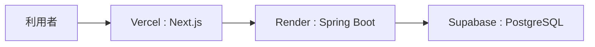

# ERROR HUB

開発中に発生したエラー情報を、登録・検索・共有するためのフルスタック Web アプリケーションです。

エラー内容だけでなく、原因・解決方法・再発防止策をあわせて蓄積し、同じ問題の調査時間を短縮することを目的に作成しました。

## Live Demo

- Frontend: https://errorhub-self.vercel.app
- Backend API: https://errorhub-b3me.onrender.com
- Repository: https://github.com/katodaiya-1030/errorhub

> [!NOTE]
> 現在はポートフォリオ用デモとして公開しています。認証機能は未実装のため、公開 URL を知るユーザーはデータを登録・編集・削除できます。実運用では認証・認可を追加する想定です。

## 主な機能

- エラーログの新規登録
- エラーログの一覧表示
- キーワードによる横断検索
- エラーログの詳細表示・編集・削除
- ページネーション
- 入力値バリデーション
- API エラー発生時のメッセージ表示

## 使用技術

### Frontend

- Next.js 16
- TypeScript
- React Hooks
- Tailwind CSS
- Vercel

### Backend

- Java 21
- Spring Boot 4
- Spring Data JPA / Hibernate
- Jakarta Bean Validation
- REST API
- Render

### Database

- PostgreSQL
- Supabase

## アーキテクチャ



## API

| Method | Endpoint | Description |
| --- | --- | --- |
| `GET` | `/api/errors?page=0` | エラーログ一覧を取得 |
| `GET` | `/api/errors/{id}` | エラーログ詳細を取得 |
| `GET` | `/api/errors/search?keyword=Java&page=0` | キーワード検索 |
| `POST` | `/api/errors` | エラーログを登録 |
| `PUT` | `/api/errors/{id}` | エラーログを更新 |
| `DELETE` | `/api/errors/{id}` | エラーログを削除 |

## 工夫した点

### フロントエンドとバックエンドを分離した構成

Next.js と Spring Boot を分離し、フロントエンドは Vercel、バックエンドは Render にデプロイしています。環境変数 `NEXT_PUBLIC_API_URL` を利用し、ローカル環境と本番環境で API の接続先を切り替えられる構成にしました。

### API 設計と入力チェック

Entity をそのまま返さず、DTO を用いて API の入出力を管理しています。また、Jakarta Bean Validation で必須項目・文字数を検証し、不正な入力は `400 Bad Request` として返却します。

### 例外処理の共通化

`@RestControllerAdvice` を使い、バリデーションエラー、存在しないデータへのアクセス、予期しないエラーを共通形式で返すようにしています。

### 本番環境の障害調査・復旧

Render のログを確認し、Hibernate Dialect の設定不整合と Supabase の接続先ホスト名の誤りを特定・修正しました。デプロイ後に API エンドポイントの応答まで確認し、本番環境で動作する状態まで検証しています。

## ローカルでの起動方法

### 前提条件

- Java 21
- Node.js 18 以上
- MySQL 8 以上

### 1. バックエンド

ローカル MySQL に `errorhub` データベースを作成します。

```sql
CREATE DATABASE errorhub;
```

次のファイルを作成します。

```text
errorhub-back/src/main/resources/application-local.properties
```

内容は `application-local.properties.example` を参考にしてください。

PowerShell で DB パスワードを設定し、バックエンドを起動します。

```powershell
cd errorhub-back
$env:SPRING_DATASOURCE_PASSWORD="あなたのMySQLパスワード"
.\mvnw spring-boot:run
```

バックエンドは `http://localhost:8080` で起動します。

### 2. フロントエンド

```powershell
cd errorhub-front
```

`.env.local` を作成します。

```env
NEXT_PUBLIC_API_URL=http://localhost:8080/api/errors
```

依存関係をインストールして起動します。

```powershell
npm install
npm run dev
```

フロントエンドは `http://localhost:3000` で起動します。

## 今後の改善予定

- Supabase Auth と Spring Security を利用した認証・認可
- Swagger / OpenAPI による API 仕様書の公開
- ローディング表示・トースト通知などの UI / UX 改善
- API・サービス層の自動テスト追加

## ディレクトリ構成

```text
errorhub/
├── errorhub-front/       # Next.js フロントエンド
│   └── app/
│       ├── components/
│       ├── hooks/
│       ├── create/
│       └── list/
│
└── errorhub-back/        # Spring Boot バックエンド
    └── src/main/java/com/example/errorhub/
        ├── config/
        ├── controller/
        ├── dto/
        ├── entity/
        ├── exception/
        ├── repository/
        └── service/
```